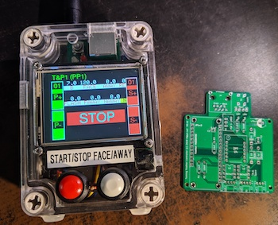
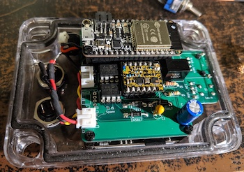

# turning-feather
## Turning controller based on an Adafruit [Feather HUZZAH32](https://www.adafruit.com/product/3405).

## Features

* More flexible than an [Auto Duel](https://web.archive.org/web/20170504011814/http://www.indelfa.co.uk/tt/ttcontruk.html) controller (and indelfa seem to have vanished), programs defined in JSON in a text file on a micro SD card. Can have a backup config file flashed to SPI accessed via SPIFFS or LITTLE FS.

  * Current maximums of 55 programs and up to 12 stages per program (limited by memory in the controller) but will increase with development and it will be easier to swap between sets of programs.

  * [Example config](arduino/turning/data/turnconf.txt).

  * Configs can be checked for JSON validity [here](https://arduinojson.org/v6/assistant/) or on any JSON website.

* Touch screen to select program/stage.

* RF remote control via [RF Solutions](https://www.rfsolutions.co.uk/) [ZPT module](https://www.rfsolutions.co.uk/radio-modules/zpt-433-868mhz-radio-telemetry-modules/?searchid=35864&search_query=zpt), compatable with their 4 button [Fobber](https://www.rfsolutions.co.uk/remote-control-systems/fobber-433mhz-868mhz-remote-control-key-fob-transmitter/?searchid=35862&search_query=fobber) or longer range [Trap](https://www.rfsolutions.co.uk/remote-control-systems/trap-handheld-transmitters-868mhz-or-918mhz-versions/?searchid=35863&search_query=trap) remote.

  Remote buttons give:
  * start/stop
  * face/away
  * stage -
  * stage +

  You can set a program and walk down range without needing to return to the unit to run, stop or change stages.

  ZPT module can be programmed to respond to several different remotes. See the [ZPT datasheet](https://www.rfsolutions.co.uk/content/download-files/ZPT-3-DATASHEET.pdf) for programming instructions. I keep the learning button internal to the unit so it can't be accidentally activated.

* Display is a [Featherwing 2.4" TFT](https://www.adafruit.com/product/3315).

* Control/power connector is RJ45; takes ground, +12V power and two signal lines for face and away activation at 12V. As used [here](https://web.archive.org/web/20190102055407/http://www.indelfa.co.uk/tt/tt_images/relay.gif).  The controls and power connections are exposed to another optional board connector if you do not want to use an onboard RJ45.

* [Parts list and assembly details](PCBs/README.md).

## Current state

* I have [custom PCB](PCBs/kicad/turning-feather) made for the main board manufactured by [PCBWay](https://www.pcbway.com/project/shareproject/Turning_Feather.html). See [schematic](PCBs/kicad/turning-feather/turning-feather.pdf).

* First production unit is in use at my local club, other ROs seem very happy with it so far since it makes running turning targets much simpler.

* Graphics are currently fairly simplistic but functional.

* RF interference is still a bit of a problem with the remote at the test range but it is usable. The bigger remote handles this better.

* Two physical buttons for face/away and start/stop. Program selection via the touchscreen.

## Future plans

Turning Feather is still very much in beta and under development.

- [ ] Config GUI to change system settings.

- [ ] Signal strength meter for the RFSolutions system.

- [ ] Add a stage name/comment to describe what each stage is for.

- [ ] The [Feather HUZZAH32](https://www.adafruit.com/product/3405) microcontroller includes wifi, this will be used for setup, programming and control.

- [ ] Ability to change which config file is in use.

- [X] Updates planned here to provide parts lists, links, etc, to allow others to build their own units.

- [ ] Provide a full definition of the config file and what all the options do.

- [ ] Add the ability to use cheaper 433MHz radio transmitters (there are some nice 4/6 button units available) as an option but getting reliable detection of events with debouncing is hard to do well, unlike with the [RF Solutions](https://www.rfsolutions.co.uk/) units.

Other TODOs in the code are noted in the [main ino file](arduino/turning/turning.ino).

No plans to sell pre-made units.

## Pull requests invited.

Feature request also invited.