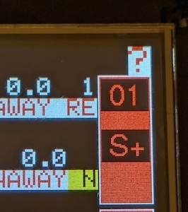

# turning-feather
## Turning controller based on an Adafruit [Feather HUZZAH32](https://www.adafruit.com/product/3405) or [Feather ESP32 V2](https://www.adafruit.com/product/5400)

# This branch

This branch is testing LVGL and associated GUI libraries and a major restructuring of the code.
WiFi connectivity is working, it will create its own WiFI network if it cannot connect elsewhere.
LVGL display with dropdowns for program and stage selections, progress bars for the current exposure/away and for the stage as a whole are working.

Either disable WiFi or set a password on the WiFi network and an admin password on settings change.
There is a config menu on the device to reset settings if they are forgotten, to disable WiFi entirely and a signal strength meter for the ZPT RF remote control.

Still to come are popup messages for any errors or WiFi issues and if the ZPT remote control is low on battery or is not properly paired.

## Features

* More flexible than an [Auto Duel](https://web.archive.org/web/20170504011814/http://www.indelfa.co.uk/tt/ttcontruk.html) controller (and indelfa seem to have vanished), programs defined in JSON in a text file on a micro SD card. Can have a backup config file flashed to SPI accessed via LittleFS.

  * Current maximums of approx 55 programs and up to 12 stages per program (limited by memory in the controller) but will increase with development and it will be easier to swap between sets of programs.

  * [Example config](data/turnconf.txt).

  * Configs can be checked for JSON validity [here](https://arduinojson.org/v7/assistant/) or on any JSON website with a checker.

* Touch screen to select program/stage and start/stop face/away.

* RF remote control via [RF Solutions](https://www.rfsolutions.co.uk/) [ZPT module](https://www.rfsolutions.co.uk/radio-modules/zpt-433-868mhz-radio-telemetry-modules/?searchid=35864&search_query=zpt), compatable with their 4 button [Fobber](https://www.rfsolutions.co.uk/remote-control-systems/fobber-433mhz-868mhz-remote-control-key-fob-transmitter/?searchid=35862&search_query=fobber) or longer range [Trap](https://www.rfsolutions.co.uk/remote-control-systems/trap-handheld-transmitters-868mhz-or-918mhz-versions/?searchid=35863&search_query=trap) remote.

  Remote buttons give:
  * start/stop
  * face/away
  * stage -
  * stage +

  You can set a program and walk down range without needing to return to the unit to run, stop or change stages. The buzzer chirps briefly by default when changing stage from the RF remote so if you are unsure which stage you are in you can go to the first or last stage (when it cannot go further so will not chirp) to establish what stage is set.

  ZPT module can be programmed to respond to several different remotes. See the [ZPT datasheet](https://www.rfsolutions.co.uk/content/download-files/ZPT-3-DATASHEET.pdf) for programming instructions. I keep the learning button internal to the unit so it can't be accidentally activated.

* Display is a [Featherwing 2.4" TFT](https://www.adafruit.com/product/3315) or [Featherwing 2.4" TFT V2](https://www.adafruit.com/product/3315).

* Optional WiFi control, with no configuration and with WiFi enabled the controller will create a WiFi network called `TurningFeather`. Connecting to that network with no password and connecting to `http://192.168.4.1/` will get you to the control page. `http://192.168.4.1/wifisetup.html` will allow you to change setup of network names and joining an existing WiFi network. The MAC address for the controller is displayed on the setup page and also over serial console while booting for setting ststic
IP addresses on your router or IP can be set on the device (not recommended). Pages like `wifisetup.html` can be protected by an admin password (default username is `admin`) but this is all sent over unencrypted HTTP so is not high security, just to keep prying fingers out.

* Control/power connector is RJ45; takes ground, +12V power and two signal lines for face and away activation at 12V. As used [here](https://web.archive.org/web/20190102055407/http://www.indelfa.co.uk/tt/tt_images/relay.gif).  The control and power connections are exposed to another optional board connector if you do not want to use a PCB mounted RJ45.

* [Parts list and assembly details](PCBs/README.md).

## Current state

* Software build and flash [managed by PlatformIO](platformio.md) for different versions of ESP32 and display boards.

* [Custom PCB](PCBs/kicad/turning-feather) made for the main IO board manufactured by [PCBWay](https://www.pcbway.com/project/shareproject/Turning_Feather.html). See [schematic](PCBs/kicad/turning-feather/turning-feather.pdf).

* New generation of graphics are in progress.

* Two physical buttons for face/away and start/stop. Program selection via the touchscreen. Start/stop, face/away and stage +/- via RF remote.

* If `USE_ZPT_SERIAL` is enabled the controller detects when it receives a packet from a remote that is not paired with the comntroller and displays a `?` character in the top right hand corner of the display. Similarly if the battery in the transmitter is low then it will display a `!` character. These characters clear the next time the controller receives a packet from a paired receiver that does not have a low battery.

* With an ESP32 V2 there is a Neopixel LED on the board, if enabled by default this will light up white during initial setup and Red/Green/Blue for beep/face/away during stages. It points backwards but if using the case with a mostly clear front it should be visible to see what part of a stage the unit is in and if it has finished from further away. This can be enabled/disabled with the `ESP_V2_NEOPIXEL` macro and the overall brightness set with `ESP_V2_NEOPIXEL_BRIGHTNESS`

* Spare 5v output for light flash or other features.

## Future plans

Turning Feather is still very much in alpha and under development however it has been in use at one club for over 6 years.

- [ ] Config GUI to change system settings.

- [ ] Signal strength meter for the RFSolutions system.

- [ ] Add a stage name/comment to describe what each stage is for.

- [X] The [Feather HUZZAH32](https://www.adafruit.com/product/3405) microcontroller includes wifi, this will be used for setup, programming and control.

- [ ] Ability to change which config file is in use.

- [X] Updates planned here to provide [parts lists](PCBs/README.md), links, etc, to allow others to build their own units.

- [ ] Provide a full definition of the config file and what all the options do.

- [ ] Add random range options for configs for face/away times.

- [ ] Add the ability to use cheaper 433MHz radio transmitters (there are some nice 4/6 button units available) as an option but getting reliable detection of events with debouncing is hard to do well, unlike with the [RF Solutions](https://www.rfsolutions.co.uk/) units.

- [X] Support for the V2 versions of Adafruit Feather/Featherwing products used.

Other TODOs in the code are noted in the [main ino file](arduino/turning/turning.ino).

No plans to sell pre-made units in any volume but I may have one spare to sell that has not been installed in a case.

## Pull requests invited.

Feature request also invited.